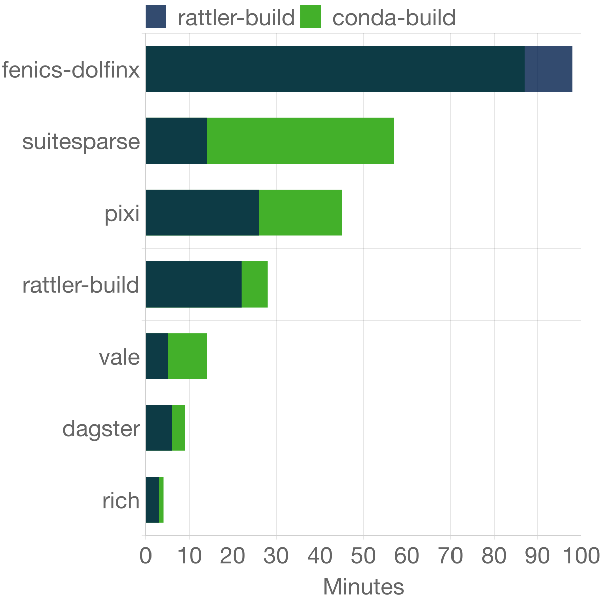

# NodeJS Project to compare Rattler and Conda Build

Rattler-build has been a huge success in improving build speeds compared to Conda Build.
The project can compare two commits of a feedstock build and figuring out the differences between them.

## Usage

```
pixi run start
```
Which results in the following table and summary:
```
│ (index) │ pkg             │ v0       │ v1       │ d           │ remaining │ speedup │
│ 0       │ 'vale'          │ '14 min' │ '5 min'  │ '9.00 min'  │ '35.7%'   │ '2.80x' │
│ 1       │ 'dagster'       │ '9 min'  │ '6 min'  │ '3.00 min'  │ '66.7%'   │ '1.50x' │
│ 2       │ 'pixi'          │ '45 min' │ '26 min' │ '19.00 min' │ '57.8%'   │ '1.73x' │
│ 3       │ 'rich'          │ '4 min'  │ '3 min'  │ '1.00 min'  │ '75.0%'   │ '1.33x' │
│ 4       │ 'suitesparse'   │ '57 min' │ '14 min' │ '43.00 min' │ '24.6%'   │ '4.07x' │
│ 5       │ 'rattler-build' │ '28 min' │ '22 min' │ '6.00 min'  │ '78.6%'   │ '1.27x' │


Cumulative Summary:
  conda-build:     157.00 min
  rattler-build:   76.00 min
  Saved:           81.00 min
  Speedup:         2.07x
  Total Packages:  6
```
It also outputs an images in `ci-durations.png`:

